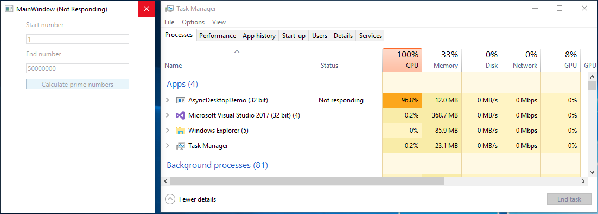
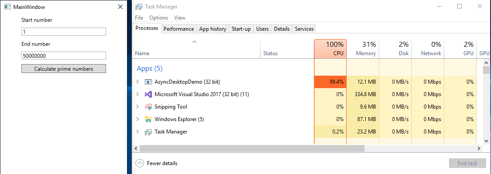
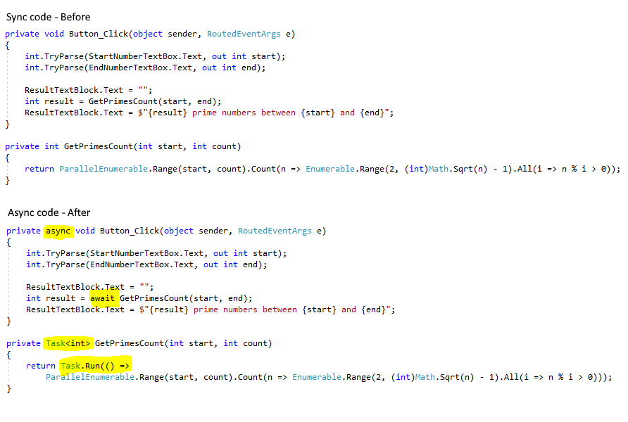

# Responsive WPF application demo
Demo source code of a WPF application to demonstrate responsive UI and the beneficts of using async

## Synchronous code

This is bad! Application is not responding

## Asynchronous code

This is good! Application still responsive with 100% CPU use

## Code compare

