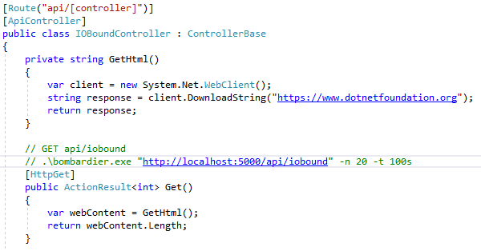
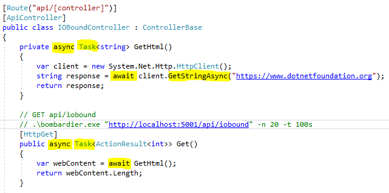
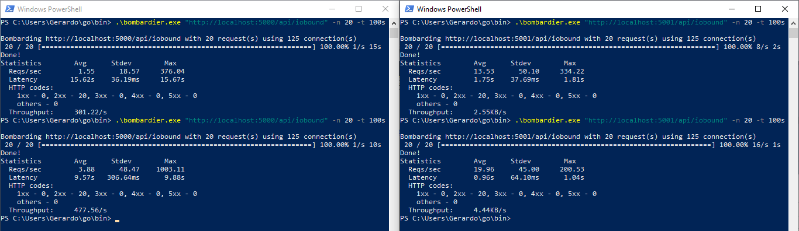
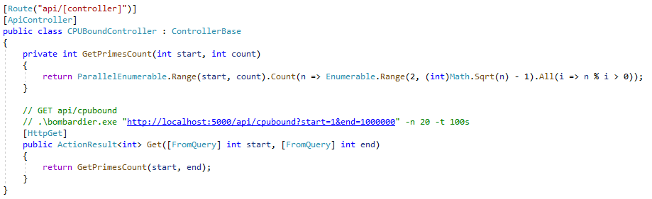
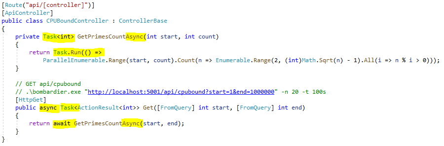
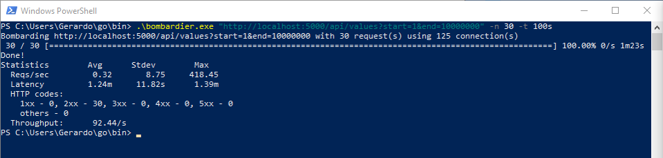
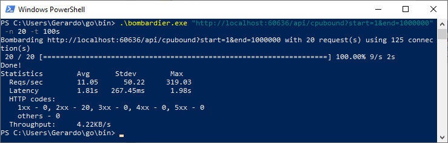

# Scalability and performance in web applications demo
Demo source code of two Web API to demonstrate performance of using async with IO-bound and CPU-bound operations

# Web API running IO-bound operation

## Synchronous code

## Asynchronous code

## Performance compare

> Using async/await makes it approximately ten times better!

# Web API running IO-bound operation

## Synchronous code

## Asynchronous code

## Performance compare

Synchronous CPU-bound

Asynchronous CPU-bound

> Using async/await makes it worse in this case!

## Summary

* Use async with IO-bound operations whenever possible
* Don’t block!
* Don’t use async for expensive CPU-bound operations
* Use benchmarking tools such as Bombardier (https://github.com/codesenberg/bombardier)

I still need more performance, what can I do?
* Scale up
* Scale out whole application using Docker/Kubernetes
* Scale out only expensive CPU-bound operations to Azure Functions
